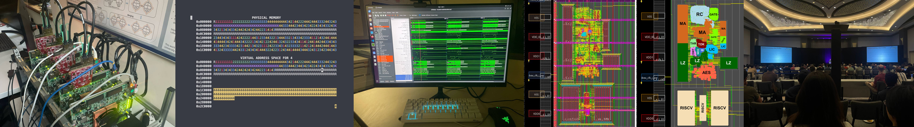

Hi, I am a senior at Yale majoring in Electrical Engineering & Computer Science (EECS) with a Japanese certificate. I am most excited about R&D, particularly in accelerating system infras. In my free time, I enjoy composing on guitar and long-distance running.

</img>

Email: anton.melnychuk@yale.edu  
Matrix: [@an.tony:matrix.org](https://matrix.to/#/@an.tony:matrix.org)  
Website: https://anton-mel.github.io/  
